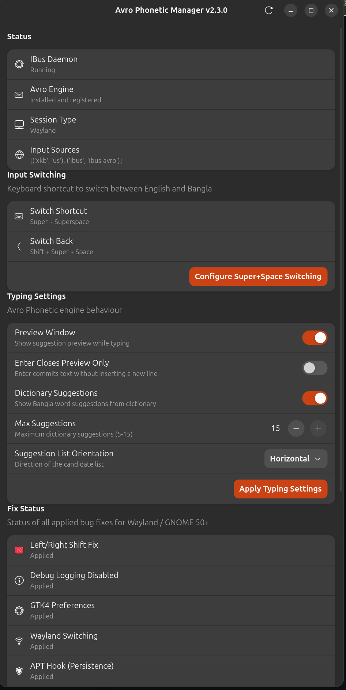

# ibus-avro-fixed — Avro Phonetic Bangla for Linux (Left Shift Fix + Wayland + GNOME 50)

Avro Phonetic lets you type Bangla by writing English phonetically — it transliterates as you type. This is a **fixed fork** of [ibus-avro](https://github.com/sarim/ibus-avro) that solves all known bugs including the **Left Shift key bug** and **Wayland input switching** on modern Ubuntu/GNOME.

The upstream `ibus-avro` was built for X11/Xorg and has been unmaintained since 2023. It has critical bugs on Ubuntu 24.04+ and Wayland. This project fixes everything and includes a modern GTK4 GUI manager.



---

## Install (One Command)

```bash
git clone https://github.com/mmhfarooque/ibus-avro-fixed.git ~/ibus-avro-fixed && cd ~/ibus-avro-fixed && bash install.sh
```

That's it. The installer handles everything:
- Installs `ibus-avro` from Ubuntu repos (if needed)
- Applies Left Shift + Right Shift fix
- Disables debug keypress logging
- Installs GTK4 preferences window
- Sets up APT hook (fixes survive system updates)
- Configures Super+Space switching for Wayland
- Installs GUI Manager + desktop shortcut
- Auto-launches the GUI

### After install

1. Open **Settings → Keyboard → Input Sources** → add **Bangla (Avro Phonetic)**
2. Press **Super+Space** to switch between English and Bangla
3. Type `ami bangla likhte pari` → আমি বাংলা লিখতে পারি

---

## What's Fixed

| Bug | Severity | Upstream (X11 era) | This Fork |
|-----|----------|---------------------|-----------|
| Left Shift key broken | **Critical** | Consumes keycode 42 | Passes through |
| Right Shift key broken | **Critical** | Not handled | Passes through |
| Input switching on Wayland | **Medium** | X11 key grabs, broken | GNOME gsettings |
| Preferences window | **Medium** | GTK3, broken on GNOME 42+ | GTK4 + libadwaita |
| Updates break fixes | **Low** | No solution | APT hook auto-fixes |
| Debug log spam | **Low** | Every keypress logged | Disabled |

### Why these bugs exist

The original ibus-avro was built for **X11/Xorg** in 2012. Ubuntu switched to **Wayland** as default in 2021 (Ubuntu 21.10). The Left Shift bug has existed for **14 years** — `return true` for keycode 42 tells IBus "I consumed this key" so the OS never sees it.

---

## GUI Manager

The Avro Phonetic Manager is a full GTK4/libadwaita application. Search **"Avro"** in your app launcher.

**Features:**
- **Status** — IBus daemon, Avro engine, session type (Wayland/X11), input sources
- **Input Switching** — current shortcut, one-click Super+Space configuration
- **Typing Settings** — preview window, dictionary, Enter behaviour, max suggestions
- **Fix Status** — dashboard showing which fixes are applied, "Apply All Fixes" button
- **Maintenance** — restart IBus, open preferences, open GNOME keyboard settings
- **Check for Updates** — self-update from Git without reinstalling
- **Restore Upstream** — uninstall all fixes with progress bar
- **Diagnostics** — activity log viewer with copy-to-clipboard for bug reporting

---

## Updates

The GUI has a **"Check for Updates"** button. It fetches the latest from GitHub, shows what changed, and updates with one click. The GUI auto-restarts after updating. No need to uninstall or re-clone.

---

## Uninstall

From the GUI: scroll to Maintenance → click **"Restore Upstream"**

From terminal:
```bash
cd ~/ibus-avro-fixed && bash uninstall.sh
```

This removes all fixes and restores stock ibus-avro. The base `ibus-avro` package stays installed.

To fully remove ibus-avro from the system:
```bash
sudo apt remove ibus-avro
```

---

## Supported Systems

- Ubuntu 24.04 LTS (Noble Numbat)
- Ubuntu 26.04 LTS (Resolute Raccoon)
- Debian 12+ (Bookworm)
- Linux Mint 21+ / Pop!_OS 22.04+
- Any Debian-based distro with IBus and GNOME

---

## How Avro Phonetic Works

Type English letters and Avro converts them to Bangla phonetically:

| You type | You get |
|----------|---------|
| `ami` | আমি |
| `bangla` | বাংলা |
| `bhalo` | ভালো |
| `dhaka` | ঢাকা |
| `tumi kemon acho` | তুমি কেমন আছো |
| `amar sonar bangla` | আমার সোনার বাংলা |

Full phonetic rules: [Avro Phonetic Layout](https://avro.im/layout)

---

## Troubleshooting

| Problem | Solution |
|---------|----------|
| Super+Space doesn't switch | Open GUI Manager → "Configure Super+Space Switching" |
| Left Shift still broken | Open GUI Manager → "Apply All Fixes" |
| Avro not in input source list | Run `ibus restart`, then add in Settings → Keyboard |
| Fixes disappear after update | APT hook should handle this. If not, run `bash install.sh` again |
| Nothing works after reboot | Log out and log back in (IBus starts on login) |

For detailed debugging, open the GUI Manager → **Diagnostics → View Log** → copy and paste.

---

## Credits

- **Original:** [Sarim Khan](https://github.com/sarim/ibus-avro) — ibus-avro engine and phonetic library
- **Contributors:** Mehdi Hasan Khan (dictionary support)
- **Fixes, GTK4 port, GUI Manager:** [Mahmud Farooque](https://github.com/mmhfarooque)

## License

MPL 2.0 (same as upstream ibus-avro)
